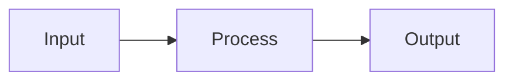

# What is Programming

``

Programming is the act of writing instructions that a computer can execute. Nothing more, nothing less.

Think of a recipe. A recipe tells a cook exactly what to do, step by step: chop the onions, heat the oil, add the garlic. If the instructions are clear and precise, the result is predictable. If they're vague ("cook until done"), the result varies.

Code works the same way. You write precise instructions, and the computer follows them exactly -- no guessing, no intuition.

## The Core Loop

Every program ever written does three things:

1. **Take input** -- data from a user, a file, a network, a sensor.
2. **Process it** -- calculate, transform, compare, combine.
3. **Produce output** -- display a result, save a file, send a response.

A calculator app takes button presses (input), computes the math (process), and shows the answer on screen (output). A web server takes an HTTP request (input), queries a database (process), and returns JSON (output). Same pattern, different scale.

## Why It Matters

Computers are fast and literal. They execute billions of instructions per second, and they do exactly what you tell them -- nothing more. This is both their power and their danger:

- If your instructions are correct, the computer produces correct results at incredible speed.
- If your instructions are wrong, the computer produces wrong results at incredible speed.

Programming is the skill of writing correct instructions.

## Levels of Abstraction

Computers only understand electrical signals -- ons and offs, represented as 1s and 0s (binary). Writing programs in binary would be impossibly tedious, so we invented layers:

| Layer | What it is | Example |
|-------|-----------|---------|
| Machine code | Binary instructions the CPU executes directly | `10110000 01100001` |
| Assembly | Human-readable names for machine instructions | `MOV AL, 61h` |
| High-level languages | English-like syntax that compiles to machine code | `x = 97` |
| Frameworks/APIs | Pre-built components for common tasks | `app.get("/users")` |

Python is a high-level language. You write `x = 97`, and Python handles the translation to machine code. You focus on *what* you want done, not *how the hardware does it*.

## The One Idea to Remember

Code is just instructions. Good programming is writing instructions that are correct, clear, and easy to change. Everything else -- languages, frameworks, architectures -- is a tool to help you write better instructions.

If you understand the recipe analogy, you understand programming. Everything else builds on that foundation.
