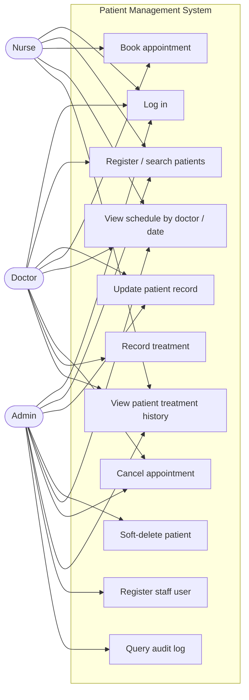
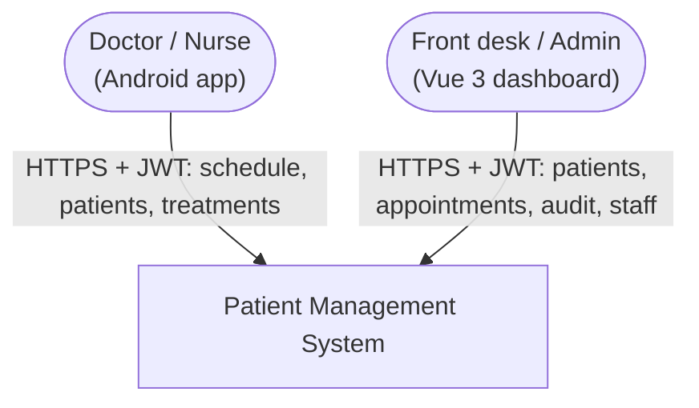
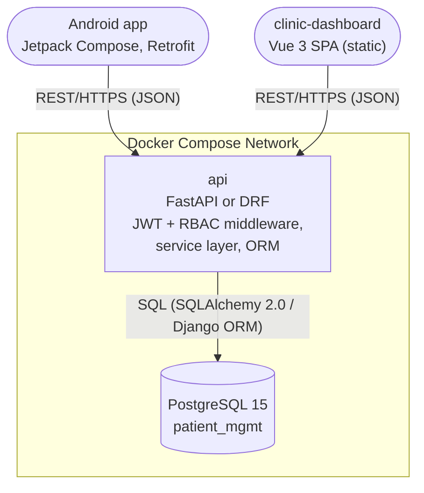
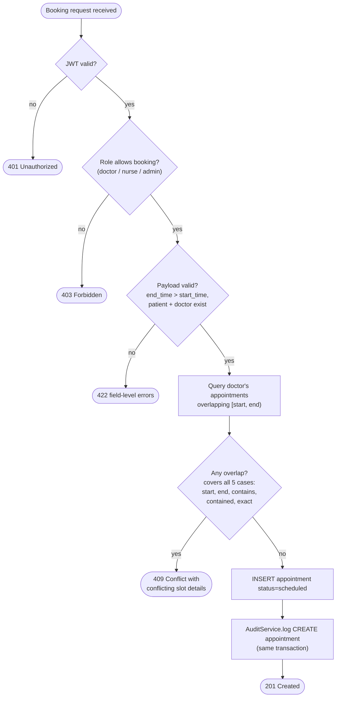
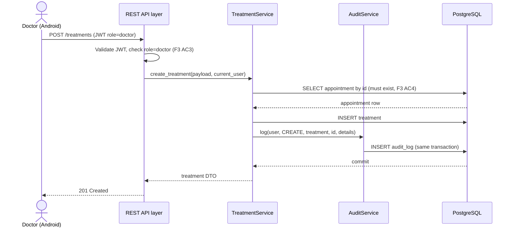
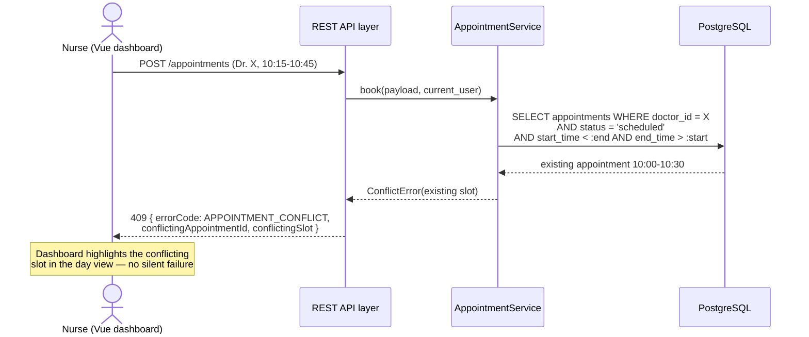
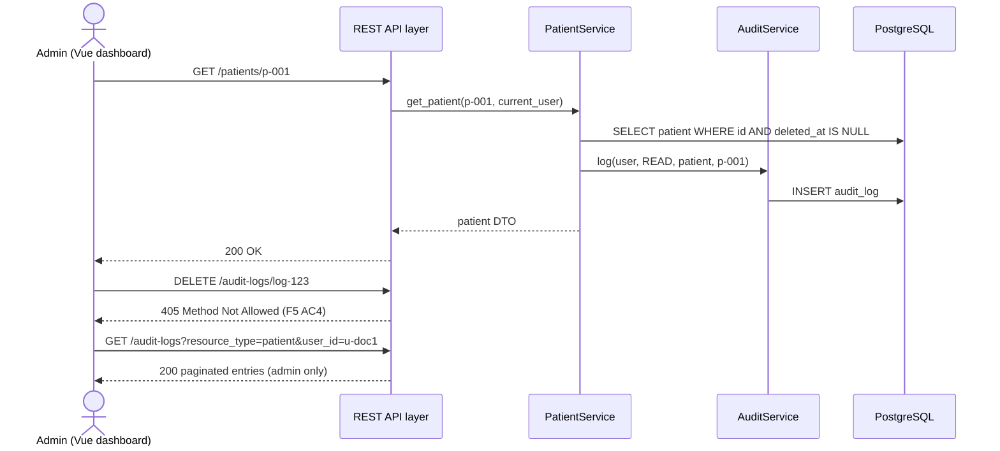

# Capstone Design: Patient Management System

> Companion to [01-capstone-spec.md](./01-capstone-spec.md). High-level and low-level design: diagrams, contracts, schemas. **How you organize your code is up to you** — the spec's ADR-2 mandates a service layer, but package/module layout is yours.

## Design Notes (read first)

1. **Two frontends, two contexts.** Front-desk staff and admins work on desktops (Vue 3 dashboard: registration, scheduling, audit review). Doctors and nurses move between rooms with a phone (Android: today's schedule, patient lookup, treatment entry). The backend is identical for both — RBAC comes from the JWT role, never from which client is calling.
2. **User management rides on `/auth/register`.** The spec's permission table gives Admin "manage users" but defines no `/users` endpoints. Rather than invent a user CRUD surface, this design makes `POST /auth/register` admin-only (first admin is seeded). Smallest design that satisfies F4.
3. **No async/event layer.** This is a deliberate 3-tier synchronous system; the audit trail is the spec's substitute for "side effects done right" (ADR-3). Part 5 is therefore N/A — if you find yourself wanting Kafka here, re-read "right tool for the right job."

---

## Part 1: High-Level Design

### 1.1 Use-Case Diagram



Permissions are exactly the spec's F4 table; the diagram shows the allowed edges (e.g., only Doctor → "Record treatment", only Admin → "Soft-delete patient" and "Query audit log").

### 1.2 System Context Diagram



No external systems. Email/SMS reminders, insurance, and lab integrations are out of scope — the system boundary is the clinic's internal record-keeping.

### 1.3 Container Diagram



One API container, one database — the tiers from the spec are *logical* layers inside the `api` container (presentation → service → data), not separate deployables. Audit log is a table in the same database, written in the same transaction as the operation it records.

### 1.4 Activity Diagram — Book Appointment (primary business process)



### 1.5 Sequence Diagrams

#### 1.5.1 Happy path — record a treatment after a visit



#### 1.5.2 Error path — double-booking rejected



The single SQL predicate `start_time < :end AND end_time > :start` covers all five overlap cases from F2 AC3 — make your tests prove each case individually anyway.

#### 1.5.3 Audit path — patient read leaves a trail, log is immutable



---

## Part 2: Frontend Design

### 2.1 Frontend Justification

| Frontend | Actors | Why |
|---|---|---|
| Vue 3 clinic dashboard (desktop) | Admin, front-desk nurse | Registration, week-view scheduling, audit review need screen space and keyboard |
| Android app (Jetpack Compose) | Doctor, nurse | Between exam rooms: today's schedule, patient lookup, treatment entry on a phone |

Same API, same RBAC. The Android app simply never shows what the role can't do (e.g., a nurse sees treatment history read-only, no "add treatment" button) — but the backend enforces it regardless (F3 AC3 is a server test, not a UI promise).

### 2.2 Route Map (Vue 3) and Screen Map (Android)

**Vue 3 — clinic-dashboard**

| Route | Name | Purpose |
|---|---|---|
| `/login` | Login | Email + password → JWT |
| `/` | Today | Today's appointments across all doctors; quick links |
| `/patients` | PatientList | Paginated search; create button (doctor/nurse/admin) |
| `/patients/new` | PatientCreate | Registration form with field-level 422 display |
| `/patients/:id` | PatientDetail | Demographics, medical history, treatments tab, appointments tab. Edit (doctor/admin), soft-delete (admin) |
| `/appointments` | Schedule | Week view per doctor; date-range + doctor filter; booking dialog |
| `/staff` | StaffRegister | Admin-only: create doctor/nurse/admin accounts (calls `/auth/register`) |
| `/audit-logs` | AuditLog | Admin-only: filterable, paginated, read-only table |
| `/:pathMatch(.*)*` | NotFound | 404 |

Pinia stores: `auth` (token, role, expiry), `patients`, `appointments`. Router guards: all routes need auth; `/staff` and `/audit-logs` need `role === 'admin'`.

**Android — clinic-mobile (Navigation Compose)**

| Screen | Purpose |
|---|---|
| `LoginScreen` | Email + password; token stored in EncryptedSharedPreferences |
| `TodayScheduleScreen` | Logged-in doctor's appointments today (nurse: all doctors); pull-to-refresh; tap → detail |
| `AppointmentDetailScreen` | Slot info + patient summary; cancel (doctor); "Record treatment" (doctor, post-visit) |
| `PatientSearchScreen` | Debounced name search against `GET /patients` |
| `PatientDetailScreen` | Tabs: Info / Treatment history (chronological, F3 AC2) |
| `TreatmentFormScreen` | Doctor only: diagnosis, prescription, plan; linked to the appointment it was opened from |

Retrofit for API calls; Coil unused unless you add patient photos (not in spec — skip it).

### 2.3 Key UI Interactions

| Interaction | Behavior |
|---|---|
| Auth | JWT in `Authorization: Bearer`. On 401: clear state → login. Vue: interceptor + Pinia; Android: OkHttp interceptor. Token expiry is server-configured (`JWT_EXPIRE_MINUTES`) — clients must not assume a duration |
| Role-gated UI | Nav items and action buttons render from the JWT `role` claim; the server remains the enforcement point |
| Booking conflict (409) | Booking dialog shows the conflicting slot returned in the error body and keeps the form open for correction — the most important UX in the app |
| Field-level 422 | Backend returns `{ errors: { field: [messages] } }`; Vue form maps messages under inputs; Compose shows `supportingText` per field |
| Soft-delete | Admin-only, confirmation dialog states "record is retained for legal compliance, hidden from lists" — teach the *why* in the UI copy |
| Audit log view | Strictly read-only table; no edit/delete affordances exist (mirrors 405 behavior) |
| Treatment entry flow | Android: AppointmentDetail → TreatmentForm pre-fills patient_id, doctor_id, appointment_id — only clinical text is typed on the phone |

---

## Part 3: API Contracts

Base: `/api/v1` prefix optional — keep consistent. Auth: `Authorization: Bearer <JWT>`; claims `sub` (user id), `role` (`doctor` | `nurse` | `admin`), `exp`.

Error envelope:

```json
{ "status": 422, "errorCode": "VALIDATION_ERROR", "message": "Invalid patient payload", "errors": { "email": ["value is not a valid email address"], "date_of_birth": ["must not be in the future"] } }
```

### Auth

| | |
|---|---|
| Endpoint | `POST /auth/register` |
| Auth | ADMIN (see Design Note 2; first admin is seeded) |
| Request | `{ "email": string, "password": string, "role": "doctor" \| "nurse" \| "admin", "full_name": string }` |
| Response 201 | `{ "id": uuid, "email": string, "role": string, "full_name": string, "created_at": iso8601 }` |
| Errors | `409 EMAIL_TAKEN`, `422 VALIDATION_ERROR`, `403` |

| | |
|---|---|
| Endpoint | `POST /auth/login` |
| Auth | None |
| Request | `{ "email": string, "password": string }` |
| Response 200 | `{ "access_token": string, "token_type": "bearer", "expires_in": number, "role": string }` |
| Errors | `401 INVALID_CREDENTIALS` |

### Patients

| | |
|---|---|
| Endpoint | `GET /patients?search=&page=1&size=20` |
| Auth | Any authenticated |
| Response 200 | `{ "items": [PatientSummary], "page": 1, "size": 20, "total": 134 }` — `PatientSummary`: `{ "id": uuid, "first_name": string, "last_name": string, "date_of_birth": date, "phone": string }`. Soft-deleted excluded (F1 AC5) |

| | |
|---|---|
| Endpoint | `POST /patients` |
| Auth | doctor, nurse, admin |
| Request | `{ "first_name": string, "last_name": string, "date_of_birth": date, "gender": string, "phone": string, "email": string, "address": string, "medical_history": string }` |
| Response 201 | Full Patient (request fields + `id`, `created_at`, `updated_at`) |
| Errors | `422 VALIDATION_ERROR` (missing fields, bad email, future DOB — F1 AC6) |
| Side effect | Audit `CREATE patient` |

| | |
|---|---|
| Endpoint | `GET /patients/{id}` |
| Auth | Any authenticated |
| Response 200 | Full Patient |
| Errors | `404 PATIENT_NOT_FOUND` (includes soft-deleted) |
| Side effect | Audit `READ patient` (F5 AC1) |

| | |
|---|---|
| Endpoint | `PUT /patients/{id}` |
| Auth | doctor, admin |
| Request | Same shape as POST (full replace) |
| Response 200 | Full Patient |
| Errors | `404`, `422`, `403` (nurse) |
| Side effect | Audit `UPDATE patient` with changed-fields diff in `details` |

| | |
|---|---|
| Endpoint | `DELETE /patients/{id}` |
| Auth | admin |
| Response 204 | (empty) |
| Errors | `404`, `403` |
| Side effect | Sets `deleted_at`; audit `DELETE patient` |

### Appointments

| | |
|---|---|
| Endpoint | `GET /appointments?doctor_id=&patient_id=&date_from=&date_to=&status=&page=1&size=20` |
| Auth | Any authenticated |
| Response 200 | `{ "items": [Appointment], ...pagination }` — `Appointment`: `{ "id": uuid, "patient_id": uuid, "patient_name": string, "doctor_id": uuid, "doctor_name": string, "start_time": iso8601, "end_time": iso8601, "status": "scheduled" \| "completed" \| "cancelled", "notes": string }` |

| | |
|---|---|
| Endpoint | `POST /appointments` |
| Auth | doctor, nurse, admin |
| Request | `{ "patient_id": uuid, "doctor_id": uuid, "start_time": iso8601, "end_time": iso8601, "notes": string }` |
| Response 201 | Appointment |
| Errors | `409 APPOINTMENT_CONFLICT` with `{ "conflicting_appointment_id": uuid, "conflicting_slot": { "start_time", "end_time" } }`; `422` (end <= start, unknown patient/doctor) |

| | |
|---|---|
| Endpoint | `GET /appointments/{id}` |
| Auth | Any authenticated |
| Response 200 | Appointment |

| | |
|---|---|
| Endpoint | `PATCH /appointments/{id}` |
| Auth | doctor, admin (cancel); doctor (complete, notes) |
| Request | `{ "status": "cancelled" \| "completed" }` and/or `{ "notes": string }` |
| Response 200 | Appointment |
| Errors | `404`, `422 INVALID_STATUS_TRANSITION` (e.g., cancelled → completed), `403` (nurse) |

### Treatments

| | |
|---|---|
| Endpoint | `POST /treatments` |
| Auth | doctor only (F3 AC3) |
| Request | `{ "patient_id": uuid, "appointment_id": uuid, "diagnosis": string, "prescription": string, "treatment_plan": string, "date": date }` — `doctor_id` comes from the JWT, never the payload |
| Response 201 | Treatment (request + `id`, `doctor_id`, `created_at`) |
| Errors | `403` (nurse/admin), `422 UNKNOWN_APPOINTMENT` (F3 AC4) |

| | |
|---|---|
| Endpoint | `GET /patients/{id}/treatments` |
| Auth | Any authenticated |
| Response 200 | `[Treatment]` ordered by `date` ascending (chronological, F3 AC2) |

| | |
|---|---|
| Endpoint | `GET /treatments/{id}` |
| Auth | Any authenticated |
| Response 200 | Treatment |

### Audit

| | |
|---|---|
| Endpoint | `GET /audit-logs?resource_type=&user_id=&action=&date_from=&date_to=&page=1&size=20` |
| Auth | admin only |
| Response 200 | `{ "items": [{ "id": uuid, "user_id": uuid, "user_email": string, "action": "CREATE" \| "READ" \| "UPDATE" \| "DELETE", "resource_type": string, "resource_id": uuid, "details": object, "timestamp": iso8601 }], ...pagination }` |
| Other methods | `PUT/PATCH/DELETE /audit-logs/*` → `405 Method Not Allowed` (F5 AC4) |

---

## Part 4: Database Schema

```sql
CREATE TABLE users (
    id            UUID PRIMARY KEY DEFAULT gen_random_uuid(),
    email         VARCHAR(255) NOT NULL UNIQUE,
    password_hash VARCHAR(255) NOT NULL,            -- bcrypt/argon2; never store plaintext
    role          VARCHAR(16)  NOT NULL CHECK (role IN ('doctor','nurse','admin')),
    full_name     VARCHAR(128) NOT NULL,
    created_at    TIMESTAMPTZ  NOT NULL DEFAULT now()
);

CREATE TABLE patients (
    id              UUID PRIMARY KEY DEFAULT gen_random_uuid(),
    first_name      VARCHAR(64)  NOT NULL,
    last_name       VARCHAR(64)  NOT NULL,
    date_of_birth   DATE         NOT NULL CHECK (date_of_birth <= CURRENT_DATE),
    gender          VARCHAR(16),
    phone           VARCHAR(32),
    email           VARCHAR(255),
    address         TEXT,
    medical_history TEXT,
    deleted_at      TIMESTAMPTZ,                    -- soft delete (ADR-4); NULL = active
    created_at      TIMESTAMPTZ  NOT NULL DEFAULT now(),
    updated_at      TIMESTAMPTZ  NOT NULL DEFAULT now()
);

-- List/search always filters deleted_at IS NULL; partial index keeps it cheap.
CREATE INDEX idx_patients_active_name ON patients (last_name, first_name) WHERE deleted_at IS NULL;

CREATE TABLE appointments (
    id         UUID PRIMARY KEY DEFAULT gen_random_uuid(),
    patient_id UUID        NOT NULL REFERENCES patients(id),
    doctor_id  UUID        NOT NULL REFERENCES users(id),
    start_time TIMESTAMPTZ NOT NULL,
    end_time   TIMESTAMPTZ NOT NULL,
    status     VARCHAR(16) NOT NULL DEFAULT 'scheduled' CHECK (status IN ('scheduled','completed','cancelled')),
    notes      TEXT,
    created_at TIMESTAMPTZ NOT NULL DEFAULT now(),
    CHECK (end_time > start_time)                   -- F2 AC6, enforced twice: app (422) + DB (defense)
);

-- Conflict query: WHERE doctor_id = ? AND status = 'scheduled'
--                 AND start_time < :end AND end_time > :start
CREATE INDEX idx_appointments_doctor_time ON appointments (doctor_id, start_time, end_time);
CREATE INDEX idx_appointments_patient ON appointments (patient_id, start_time DESC);

CREATE TABLE treatments (
    id             UUID PRIMARY KEY DEFAULT gen_random_uuid(),
    patient_id     UUID NOT NULL REFERENCES patients(id),
    doctor_id      UUID NOT NULL REFERENCES users(id),
    appointment_id UUID NOT NULL REFERENCES appointments(id),  -- F3 AC4: must exist
    diagnosis      TEXT NOT NULL,
    prescription   TEXT,
    treatment_plan TEXT,
    date           DATE NOT NULL,
    created_at     TIMESTAMPTZ NOT NULL DEFAULT now()
);

CREATE INDEX idx_treatments_patient_date ON treatments (patient_id, date);

CREATE TABLE audit_logs (
    id            UUID PRIMARY KEY DEFAULT gen_random_uuid(),
    user_id       UUID        NOT NULL REFERENCES users(id),
    action        VARCHAR(16) NOT NULL CHECK (action IN ('CREATE','READ','UPDATE','DELETE')),
    resource_type VARCHAR(32) NOT NULL,
    resource_id   UUID        NOT NULL,
    details       JSONB,                            -- changed-fields diff on UPDATE (F5 AC2)
    timestamp     TIMESTAMPTZ NOT NULL DEFAULT now()
);
-- Immutability is enforced at the API (405) and by granting the app role
-- INSERT/SELECT only on this table — no UPDATE/DELETE grants. State this in your README.

CREATE INDEX idx_audit_resource ON audit_logs (resource_type, resource_id, timestamp DESC);
CREATE INDEX idx_audit_user_time ON audit_logs (user_id, timestamp DESC);
```

Non-obvious decisions: `deleted_at` over a boolean (records *when*, supports retention audits); the `CHECK (end_time > start_time)` duplicates app validation deliberately — the DB is the last line of defense; audit immutability via missing grants is stronger than any application code.

---

## Part 5: Event Contracts

**N/A.** No asynchronous communication exists in this system (see Design Note 3). All side effects (audit logging) are synchronous, same-transaction writes.

---

## Part 6: Seed Data

```sql
-- Users: one of each role + a second doctor (conflict-detection scenarios need two doctors)
-- Password for all seed users: "Passw0rd!" (hash with your chosen algorithm at seed time)
INSERT INTO users (id, email, password_hash, role, full_name) VALUES
('u0000001-0000-0000-0000-000000000001', 'admin@clinic.test',   '<hash>', 'admin',  'Apinya Srisuwan'),
('u0000001-0000-0000-0000-000000000002', 'dr.somchai@clinic.test', '<hash>', 'doctor', 'Dr. Somchai Jaidee'),
('u0000001-0000-0000-0000-000000000003', 'dr.malee@clinic.test',   '<hash>', 'doctor', 'Dr. Malee Suksai'),
('u0000001-0000-0000-0000-000000000004', 'nurse.nok@clinic.test',  '<hash>', 'nurse',  'Nok Chaiyo');

INSERT INTO patients (id, first_name, last_name, date_of_birth, gender, phone, email, address, medical_history, deleted_at) VALUES
('p0000001-0000-0000-0000-000000000001', 'Prasert', 'Boonmee',   '1958-03-12', 'male',   '081-111-1111', 'prasert@example.test', 'Khon Kaen',    'Type 2 diabetes, hypertension', NULL),
('p0000001-0000-0000-0000-000000000002', 'Siriporn','Thongchai', '1990-07-25', 'female', '081-222-2222', 'siriporn@example.test','Chiang Mai',   'Asthma',                        NULL),
('p0000001-0000-0000-0000-000000000003', 'Anan',    'Wongsa',    '2015-11-02', 'male',   '081-333-3333', NULL,                   'Bangkok',      'None',                          NULL),
('p0000001-0000-0000-0000-000000000004', 'Duangjai','Phromma',   '1975-01-30', 'female', '081-444-4444', 'duangjai@example.test','Udon Thani',   'Allergic to penicillin',        NULL),
('p0000001-0000-0000-0000-000000000005', 'Wichai',  'Kamol',     '1982-09-14', 'male',   '081-555-5555', NULL,                   'Bangkok',      'None',
 now() - interval '10 days');  -- soft-deleted: must NOT appear in lists, 404 on GET

-- Appointments: Dr. Somchai has 10:00-11:00 tomorrow — the fixture for all five
-- overlap rejection tests in F2 AC3. Plus cancelled + completed states.
INSERT INTO appointments (id, patient_id, doctor_id, start_time, end_time, status, notes) VALUES
('a0000001-0000-0000-0000-000000000001', 'p0000001-0000-0000-0000-000000000001', 'u0000001-0000-0000-0000-000000000002',
 date_trunc('day', now() + interval '1 day') + interval '10 hours',
 date_trunc('day', now() + interval '1 day') + interval '11 hours', 'scheduled', 'Quarterly diabetes review'),
('a0000001-0000-0000-0000-000000000002', 'p0000001-0000-0000-0000-000000000002', 'u0000001-0000-0000-0000-000000000003',
 date_trunc('day', now() + interval '1 day') + interval '10 hours',
 date_trunc('day', now() + interval '1 day') + interval '10 hours 30 minutes', 'scheduled', NULL),
 -- same time, DIFFERENT doctor: must NOT conflict
('a0000001-0000-0000-0000-000000000003', 'p0000001-0000-0000-0000-000000000003', 'u0000001-0000-0000-0000-000000000002',
 now() - interval '7 days', now() - interval '7 days' + interval '30 minutes', 'completed', 'Child vaccination'),
('a0000001-0000-0000-0000-000000000004', 'p0000001-0000-0000-0000-000000000004', 'u0000001-0000-0000-0000-000000000002',
 now() - interval '2 days', now() - interval '2 days' + interval '30 minutes', 'cancelled', 'Patient rescheduled');

-- Treatments: history for Prasert (chronological list test), linked to a completed appointment
INSERT INTO treatments (id, patient_id, doctor_id, appointment_id, diagnosis, prescription, treatment_plan, date) VALUES
('t0000001-0000-0000-0000-000000000001', 'p0000001-0000-0000-0000-000000000001', 'u0000001-0000-0000-0000-000000000002',
 'a0000001-0000-0000-0000-000000000003', 'Type 2 diabetes — stable', 'Metformin 500mg twice daily', 'Continue medication, HbA1c recheck in 3 months', (now() - interval '7 days')::date);

-- Audit entries demonstrating READ + CREATE trails and the admin query view
INSERT INTO audit_logs (user_id, action, resource_type, resource_id, details, timestamp) VALUES
('u0000001-0000-0000-0000-000000000002', 'CREATE', 'patient',   'p0000001-0000-0000-0000-000000000001', '{"fields": "all"}', now() - interval '90 days'),
('u0000001-0000-0000-0000-000000000004', 'READ',   'patient',   'p0000001-0000-0000-0000-000000000001', NULL,                now() - interval '1 day'),
('u0000001-0000-0000-0000-000000000002', 'UPDATE', 'patient',   'p0000001-0000-0000-0000-000000000001', '{"changed": {"phone": ["081-000-0000", "081-111-1111"]}}', now() - interval '30 days'),
('u0000001-0000-0000-0000-000000000001', 'DELETE', 'patient',   'p0000001-0000-0000-0000-000000000005', '{"reason": "duplicate record"}', now() - interval '10 days');
```

| Seeded scenario | What it exercises |
|---|---|
| 4 users across 3 roles | Every row of the F4 permission table |
| Soft-deleted Wichai | Excluded from lists, 404 on detail, visible in audit trail |
| Dr. Somchai 10:00–11:00 tomorrow | All five overlap rejections (F2 AC3) |
| Dr. Malee same time slot | Overlap check is per-doctor, not global |
| Completed + cancelled appointments | Status filters, PATCH transition rules |
| Treatment linked to completed appointment | F3 AC2 history + F3 AC4 valid reference |
| 4 audit actions | Admin audit query with every action type |
