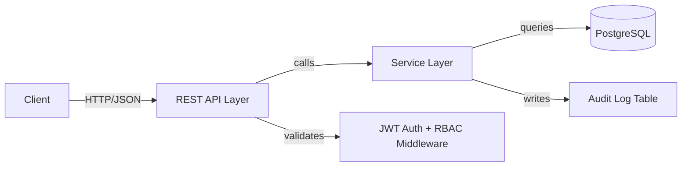
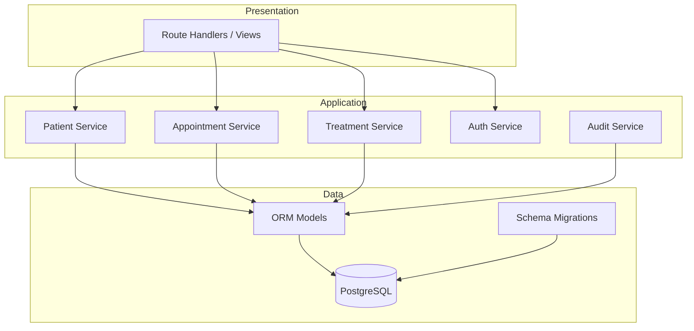
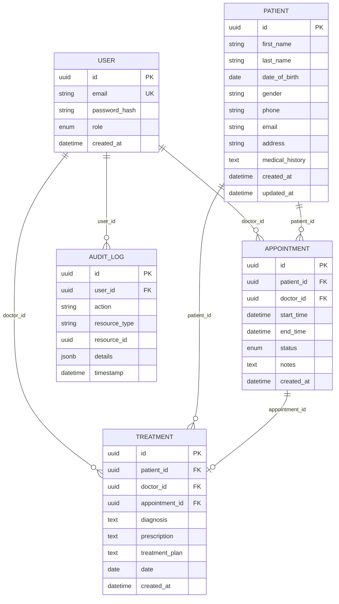

# Workshop: Patient Management System

## Business Context

A mid-size clinic needs a backend system to manage patients, appointments, and treatment records. The system must enforce role-based access and maintain a HIPAA-compliant audit trail of all record access.

Challenge repo: https://github.com/TP-Coder-Innovation-Hub/patient-management-system-challenge

## Learning Objectives

- Design and implement a 3-tier REST API (presentation, service, data)
- Model relational data with PostgreSQL and an ORM
- Implement JWT authentication with role-based access control
- Write business logic with proper validation and error handling
- Build conflict-detection algorithms (appointment scheduling)
- Apply HIPAA-compliant audit logging
- Containerize with Docker Compose
- Write unit and integration tests

## Architecture





## Data Model



## Feature Requirements

### F1: Patient CRUD

Create, read, update, and soft-delete patient records with medical history.

**AC1: Create patient**
- Given a valid patient payload
- When POST /patients is called by a doctor or nurse
- Then a new patient record is created and returned with status 201
- And the action is recorded in the audit log

**AC2: List patients with pagination**
- Given patients exist in the database
- When GET /patients?page=1&size=20 is called by any authenticated user
- Then a paginated list of patients is returned with total count

**AC3: Get patient by ID**
- Given a patient with ID exists
- When GET /patients/{id} is called by any authenticated user
- Then the patient record is returned with status 200
- And the access is recorded in the audit log

**AC4: Update patient**
- Given a patient with ID exists
- When PUT /patients/{id} is called by a doctor or admin
- Then the patient record is updated and returned with status 200

**AC5: Soft-delete patient**
- Given a patient with ID exists
- When DELETE /patients/{id} is called by an admin
- Then the patient is marked inactive (not physically deleted)
- And the record no longer appears in list endpoints

**AC6: Validation**
- Given an invalid payload (missing required fields, invalid email format, future date_of_birth)
- When POST /patients is called
- Then a 422 response is returned with specific field-level error messages

---

### F2: Appointment Scheduling

Book, list, update, and cancel appointments with conflict detection.

**AC1: Book appointment**
- Given a valid appointment payload (patient_id, doctor_id, start_time, end_time)
- When POST /appointments is called by a doctor or nurse
- Then the appointment is created and returned with status 201

**AC2: No double-booking**
- Given doctor X already has an appointment from 10:00 to 10:30
- When POST /appointments is called for doctor X from 10:15 to 10:45
- Then a 409 Conflict response is returned with a message indicating the time conflict

**AC3: Conflict detection covers all overlaps**
- Given existing appointment from 10:00 to 11:00
- Then each of the following new appointments MUST be rejected:
  - 09:30–10:15 (overlaps start)
  - 10:45–11:30 (overlaps end)
  - 09:00–12:00 (fully contains existing)
  - 10:15–10:45 (fully contained by existing)
  - 10:00–11:00 (exact match)

**AC4: List appointments by doctor and date range**
- Given appointments exist for a doctor
- When GET /appointments?doctor_id=X&date_from=2025-01-01&date_to=2025-01-31 is called
- Then a filtered list of appointments is returned

**AC5: Cancel appointment**
- Given an appointment with status "scheduled"
- When PATCH /appointments/{id} with status "cancelled" is called by a doctor or admin
- Then the appointment status is updated to "cancelled"

**AC6: End time must be after start time**
- Given an appointment payload where end_time <= start_time
- When POST /appointments is called
- Then a 422 response is returned

---

### F3: Treatment Tracking

Record and retrieve diagnoses, prescriptions, and treatment plans linked to patients and appointments.

**AC1: Create treatment record**
- Given a valid treatment payload (patient_id, doctor_id, appointment_id, diagnosis, prescription, treatment_plan)
- When POST /treatments is called by a doctor
- Then the treatment record is created and returned with status 201

**AC2: List treatments for a patient**
- Given treatment records exist for a patient
- When GET /patients/{id}/treatments is called by any authenticated user
- Then a chronological list of treatments is returned

**AC3: Only doctors can create treatments**
- Given a user with role "nurse"
- When POST /treatments is called
- Then a 403 Forbidden response is returned

**AC4: Treatment must reference a valid appointment**
- Given a treatment payload referencing a non-existent appointment_id
- When POST /treatments is called
- Then a 422 response is returned

---

### F4: Role-Based Access Control

Three roles with distinct permissions enforced at the service or middleware level.

| Permission | Doctor | Nurse | Admin |
|---|---|---|---|
| CRUD patients | Full | Read + Create | Full |
| Manage appointments | Full | Read + Create | Full |
| Manage treatments | Full | Read only | Read only |
| Manage users | No | No | Full |
| View audit log | No | No | Yes |

**AC1: Unauthenticated request is rejected**
- Given no Authorization header
- When any endpoint is called
- Then a 401 Unauthorized response is returned

**AC2: Insufficient role is rejected**
- Given a user with role "nurse"
- When DELETE /patients/{id} is called
- Then a 403 Forbidden response is returned

**AC3: JWT contains role**
- Given a valid login with email and password
- When POST /auth/login is called
- Then a JWT token is returned containing user_id and role
- And the token expires after a configurable duration

---

### F5: Audit Log

HIPAA-compliant logging of record access.

**AC1: Log on read**
- Given a patient record is accessed via GET /patients/{id}
- When the request completes successfully
- Then an audit log entry is created with user_id, action="READ", resource_type="patient", resource_id, and timestamp

**AC2: Log on write**
- Given a patient is created, updated, or deleted
- When the operation completes successfully
- Then an audit log entry is created with action="CREATE"|"UPDATE"|"DELETE" and a details JSON containing changed fields

**AC3: Query audit log**
- Given audit log entries exist
- When GET /audit-logs?resource_type=patient&user_id=X&date_from=...&date_to=... is called by an admin
- Then a filtered, paginated list of audit entries is returned

**AC4: Audit logs are immutable**
- Given an existing audit log entry
- When PUT or DELETE /audit-logs/{id} is called
- Then a 405 Method Not Allowed response is returned

## Tech Constraints

| Constraint | Requirement |
|---|---|
| Framework | FastAPI or Django REST Framework (learner chooses) |
| Database | PostgreSQL 15+ |
| ORM | SQLAlchemy 2.0 (FastAPI) or Django ORM |
| Authentication | JWT (python-jose or PyJWT for FastAPI; simplejwt for DRF) |
| Validation | Pydantic v2 (FastAPI) or Django REST Framework serializers |
| Containerization | Docker Compose with app + PostgreSQL services |
| Testing | pytest with pytest-asyncio (if async) or Django test runner |
| Migrations | Alembic (FastAPI) or Django migrations |
| Python | 3.11+ |

### Required Endpoints

```
Auth:
  POST   /auth/register
  POST   /auth/login

Patients:
  GET    /patients
  POST   /patients
  GET    /patients/{id}
  PUT    /patients/{id}
  DELETE /patients/{id}

Appointments:
  GET    /appointments
  POST   /appointments
  GET    /appointments/{id}
  PATCH  /appointments/{id}

Treatments:
  GET    /patients/{id}/treatments
  POST   /treatments
  GET    /treatments/{id}

Audit:
  GET    /audit-logs
```

### Docker Compose Structure

```yaml
services:
  app:
    build: .
    ports:
      - "8000:8000"
    depends_on:
      - db
    environment:
      - DATABASE_URL=postgresql://...
      - JWT_SECRET=...
      - JWT_EXPIRE_MINUTES=60
  db:
    image: postgres:15
    environment:
      - POSTGRES_DB=patient_mgmt
      - POSTGRES_USER=...
      - POSTGRES_PASSWORD=...
    volumes:
      - pgdata:/var/lib/postgresql/data
    ports:
      - "5432:5432"
```

### Testing Requirements

- Unit tests for each service method (mock the data layer)
- Integration tests for each endpoint against a real PostgreSQL instance (use Docker)
- Minimum 80% code coverage
- Tests run via `docker compose run --rm app pytest`

## Architecture Decision Records

### ADR-1: Framework Choice

**Decision:** Learner chooses between FastAPI and Django REST Framework.

**Rationale:** FastAPI better demonstrates async patterns and explicit architecture. DRF provides more built-in tooling and is more common in enterprise. Both are valid; the choice should match the learner's career goals.

**Consequences:** Project structure, dependency set, and testing approach differ between the two paths. The challenge repo provides starter templates for both.

---

### ADR-2: Service Layer Pattern

**Decision:** All business logic lives in a dedicated service layer. Route handlers/views only handle HTTP concerns (parsing, serialization, response formatting).

**Rationale:** Separates concerns. Makes business logic testable without HTTP. Keeps controllers thin.

**Consequences:** Each feature has a controller (route handler) and a service class. Controllers call services. Services call the ORM. No business logic in route handlers.

---

### ADR-3: Audit Logging via Service Interceptor

**Decision:** Audit logging is handled by a dedicated AuditService called from within business services, not via database triggers or middleware.

**Rationale:** Application-level logging gives control over what details to capture (field-level diffs, user context). Keeps the audit logic portable and testable.

**Consequences:** Every service method that reads or mutates data must call AuditService.log(). Forgetting a call means a gap in the audit trail. Consider a decorator or context manager to reduce boilerplate.

---

### ADR-4: Soft Deletes for Patients

**Decision:** Patient records are soft-deleted (marked inactive) rather than hard-deleted.

**Rationale:** Medical records have legal retention requirements. Soft deletes allow recovery and audit trail integrity.

**Consequences:** All patient queries must filter by active status. A `deleted_at` timestamp column is needed on the patients table.

---

### ADR-5: Appointment Conflict Detection in Application Layer

**Decision:** Double-booking prevention is enforced in the service layer, not via database constraints.

**Rationale:** The overlap logic is non-trivial (four overlap cases) and benefits from clear error messages. Database-level exclusion constraints are a valid alternative but reduce portability.

**Consequences:** Race conditions are possible under concurrent requests. For production, add a database-level advisory lock or SERIALIZABLE isolation on the appointment insert. For this workshop, service-level checking is sufficient.

## Submission Checklist

- [ ] All endpoints implemented and returning correct status codes
- [ ] JWT authentication works (login returns token, protected routes require it)
- [ ] RBAC enforced (doctor/nurse/admin permissions match the table in F4)
- [ ] Appointment conflict detection rejects all five overlap cases
- [ ] Audit log records all CRUD and read operations on patients
- [ ] Audit log is queryable by admin and immutable
- [ ] Patients are soft-deleted, not hard-deleted
- [ ] Input validation returns 422 with field-level errors
- [ ] Docker Compose starts the full stack with one command
- [ ] Database migrations run cleanly from zero
- [ ] Unit tests for service layer (mocked data layer)
- [ ] Integration tests for endpoints (real database)
- [ ] Test coverage >= 80%
- [ ] All tests pass via `docker compose run --rm app pytest`
- [ ] No hardcoded secrets (use environment variables)
- [ ] README includes setup instructions, API documentation, and test commands
