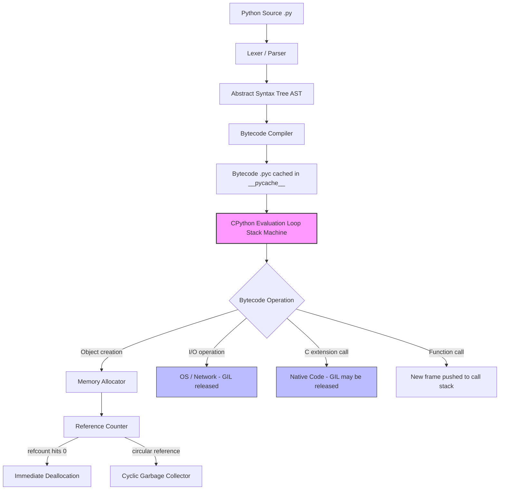
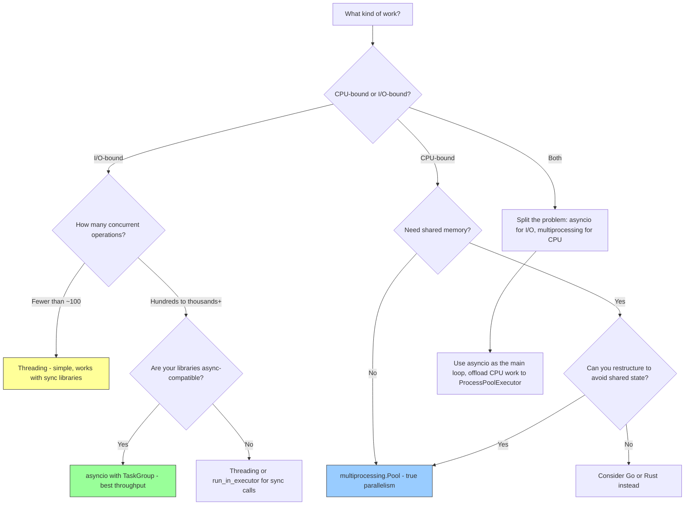
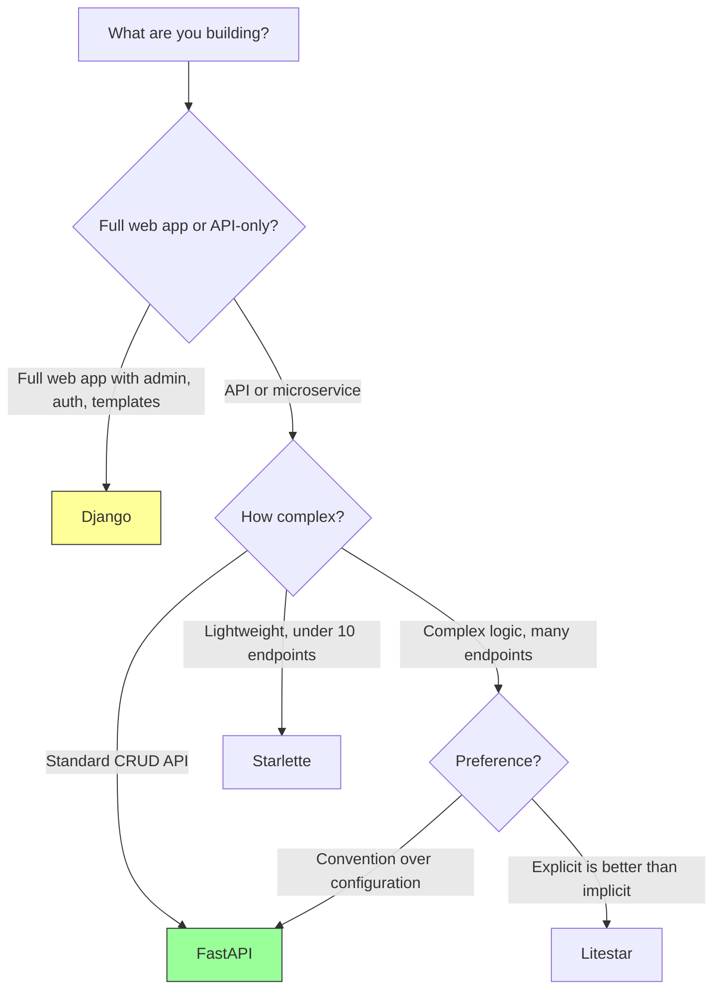
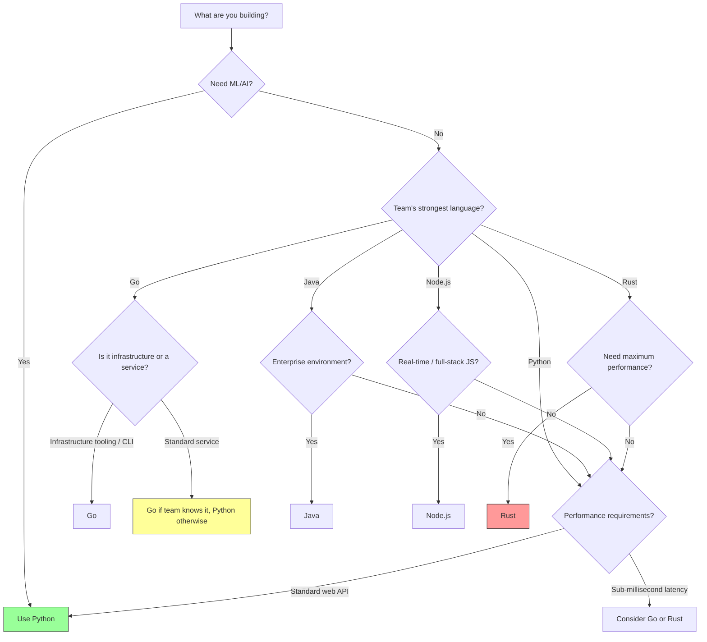

# Python Backend Developer Fundamentals

A practical, opinionated guide to Python backend development in 2026. Written for engineers who want to understand not just *how* to build backends in Python, but *why* the ecosystem looks the way it does -- and where it's headed.

This guide covers the mental models, tooling, frameworks, and decision frameworks you need to be productive. It assumes you can write Python but want to level up your backend engineering judgment.

---

## Table of Contents

1. [Why Python for Backend in 2026](#1-why-python-for-backend-in-2026)
2. [The Python Runtime Mental Model](#2-the-python-runtime-mental-model)
3. [Concurrency in Python](#3-concurrency-in-python)
4. [The Type System](#4-the-type-system)
5. [Modern Python Tooling](#5-modern-python-tooling)
6. [Framework Landscape](#6-framework-landscape)
7. [Decision Framework: When Python vs Others](#7-decision-framework-when-python-vs-others)
8. [Common Pitfalls](#8-common-pitfalls)
9. [What's Next](#9-whats-next)

---

## 1. Why Python for Backend in 2026

`[Entry]` `[Mid]` `[Senior]`

Python is the most popular language for backend development by a wide margin in 2026, and it's not close. FastAPI's adoption curve made Python the default choice for new API services. Django still powers a massive number of production applications. The language itself got faster, better typed, and more concurrent-capable with Python 3.13+.

### Where Python Wins

**API development.** FastAPI made async API development trivially easy. You get automatic OpenAPI docs, Pydantic validation, and async support out of the box. Building a CRUD API in Python is faster than in any other language right now.

**Data-heavy backends.** If your backend touches ML models, data pipelines, or analytics, Python is the only sensible choice. The ML/AI ecosystem (PyTorch, transformers, LangChain) is Python-native. No other language comes close.

**Prototyping and iteration speed.** Python lets you go from idea to working service in hours, not days. The dynamic type system (supplemented by type hints) and massive standard library mean less boilerplate and more business logic.

**Team velocity.** Python is readable enough that a mid-level engineer can review a senior engineer's code and understand it. This matters more than raw performance for most teams.

### Where Python Struggles

**CPU-bound workloads at scale.** The GIL (Global Interpreter Lock) is still a real constraint, even with free-threaded mode maturing in 3.13+. If your service is doing heavy computation per request -- image processing, cryptographic operations, data transformation -- Python will be slower than Go, Rust, or Java.

**Memory efficiency.** Python objects are memory-hungry. A Python web worker uses 30-80MB of RAM at baseline. A Go goroutine uses kilobytes. At high concurrency, this adds up.

**Startup time.** CPython's startup time has improved, but it's still measured in hundreds of milliseconds. This matters for serverless cold starts and CLI tools.

**Deployment artifact size.** A typical Python container image with dependencies is 200MB-1GB. A statically compiled Go binary is 10-20MB.

### The Honest Take

Python dominates backend development because developer productivity matters more than runtime performance for most services. If you're building internal APIs, CRUD services, ML-powered backends, or anything where time-to-market matters, Python is the right call. If you're building a high-throughput streaming service, a database engine, or latency-critical infrastructure, look elsewhere.

---

## 2. The Python Runtime Mental Model

`[Entry]` `[Mid]`

Understanding how Python executes your code prevents a whole class of performance bugs and misconceptions. Here's what actually happens when you run `python app.py`.

### CPython and Bytecode Compilation

CPython is the reference implementation. When you run a Python file, CPython does this:

1. **Lexing and parsing** -- your `.py` file is parsed into an Abstract Syntax Tree (AST).
2. **Compilation to bytecode** -- the AST is compiled to `.pyc` bytecode files (cached in `__pycache__/`).
3. **Execution by the Python VM** -- the bytecode evaluator (a stack machine) executes instructions one at a time.

Python is not interpreted line-by-line. It's compiled to bytecode and then the VM executes that bytecode. The compilation step is fast, which is why you don't notice it, but it's real.

```
Source (.py) --> AST --> Bytecode (.pyc) --> Python VM --> Output
```

### Reference Counting

Python uses reference counting as its primary memory management strategy, with a cyclic garbage collector as a backup. Every object has a reference count. When it hits zero, the object is immediately deallocated.

This matters because it means:
- Most objects are freed immediately and deterministically (not waiting for a GC pause).
- Circular references need the cyclic GC to detect them (which is why `__del__` behavior can be surprising).
- C extensions that don't manage refcounts correctly cause memory leaks.

### The GIL (Global Interpreter Lock)

`[Mid]` `[Senior]`

The GIL is a mutex that protects access to Python objects, preventing multiple threads from executing Python bytecode simultaneously. Only one thread runs Python code at a time, even on a multi-core machine.

The GIL exists because CPython's memory management (reference counting) is not thread-safe without it. Removing the GIL safely means either making every operation atomic (slow) or using a different memory management strategy.

**What the GIL actually means:**

| Scenario | GIL Impact |
|---|---|
| CPU-bound Python code in threads | No speedup. Threads take turns on a single core. |
| I/O-bound code in threads (network, file, DB) | Minimal impact. GIL is released during I/O waits. |
| CPU-bound code via `multiprocessing` | Full multi-core utilization. Each process has its own GIL. |
| C extensions that release the GIL (NumPy, etc.) | Can run in parallel. The extension releases the GIL during computation. |

### Free-Threaded Python (PEP 703, Python 3.13+)

`[Senior]`

Python 3.13 introduced an experimental free-threaded build (`--disable-gil`) based on the `nogil` project (PEP 703). In 3.13 and 3.14, this is opt-in and experimental. By 3.15-3.16, it's expected to be production-ready.

Free-threaded Python removes the GIL by replacing reference counting with a biased reference counting scheme and adding per-object locks. This means true parallel thread execution for Python code.

**Current status (2026):** Free-threaded mode works but many C extensions don't support it yet. The major scientific packages (NumPy, pandas) have free-threaded builds. Most web libraries work. But you should test your full dependency tree before relying on it.

### Execution Model Diagram



---

## 3. Concurrency in Python

`[Entry]` `[Mid]` `[Senior]`

Python gives you three main concurrency models. Choosing the right one is a critical backend engineering decision.

### Threading

Threads share memory and are managed by the OS. The GIL means only one thread runs Python bytecode at a time, but the GIL is released during I/O operations (network calls, file reads, DB queries).

```python
import threading
import urllib.request

def fetch_url(url: str) -> bytes:
    return urllib.request.urlopen(url).read()

threads = []
for url in urls:
    t = threading.Thread(target=fetch_url, args=(url,))
    t.start()
    threads.append(t)

for t in threads:
    t.join()
```

**Use when:** You have I/O-bound work and need to interoperate with synchronous libraries. Legacy codebases. Simple parallelism for a handful of concurrent operations.

**Don't use when:** You have CPU-bound work (no speedup due to GIL) or need high concurrency (thousands of concurrent connections -- use asyncio).

### Multiprocessing

Each process has its own Python interpreter and its own GIL. True parallelism.

```python
from multiprocessing import Pool

def process_data(item: int) -> int:
    return item * item  # CPU-bound work

with Pool(processes=4) as pool:
    results = pool.map(process_data, range(100))
```

**Use when:** CPU-bound workloads that need multi-core parallelism. Data processing, ML inference, image transformation.

**Don't use when:** You need shared memory (processes don't share memory by default) or low overhead (spawning processes is expensive).

### Asyncio

`[Mid]` `[Senior]`

Single-threaded, event-loop-based concurrency. Coroutines yield control at `await` points, letting the event loop handle other work while waiting for I/O.

```python
import asyncio
import aiohttp

async def fetch_url(session: aiohttp.ClientSession, url: str) -> bytes:
    async with session.get(url) as response:
        return await response.read()

async def main() -> None:
    async with aiohttp.ClientSession() as session:
        tasks = [fetch_url(session, url) for url in urls]
        results = await asyncio.gather(*tasks)
```

**Use when:** High-concurrency I/O-bound workloads. API servers handling thousands of connections. Microservices making lots of downstream calls.

**Don't use when:** You have significant CPU-bound work in the event loop (it blocks everything) or your dependencies are all synchronous.

### Structured Concurrency with TaskGroup (Python 3.11+)

`[Senior]`

`asyncio.TaskGroup` provides structured concurrency -- all tasks in the group complete (or fail) together, and exceptions propagate cleanly.

```python
async def fetch_all(urls: list[str]) -> list[bytes]:
    results: list[bytes] = [b""] * len(urls)

    async with asyncio.TaskGroup() as tg:
        for i, url in enumerate(urls):
            tg.create_task(fetch_one(url, results, i))

    return results
```

TaskGroup replaces the older `asyncio.gather()` pattern. It's safer because:
- If any task raises an exception, all other tasks are cancelled.
- You can't accidentally "fire and forget" a task.
- The `async with` block ensures all tasks are done before continuing.

### Concurrency Decision Flowchart



---

## 4. The Type System

`[Entry]` `[Mid]` `[Senior]`

Python's type hint system has matured into something genuinely useful for backend development. It's not Haskell-style full type safety, but it catches bugs, enables better tooling, and serves as executable documentation.

### Why Types Matter for Backend in 2026

1. **Refactoring confidence.** Change a function signature, and your type checker tells you every call site that breaks. In a large codebase, this is the difference between a 5-minute refactor and a 2-hour debugging session.

2. **API contract enforcement.** FastAPI uses type hints to generate OpenAPI specs, validate request/response bodies via Pydantic, and route requests. Your types *are* your API documentation.

3. **IDE support.** Pyright (used by VS Code's Pylance) provides real-time type checking, autocomplete, and refactoring tools that are genuinely useful.

4. **Onboarding.** Type-annotated code is self-documenting. A new team member can read `def get_user(user_id: int) -> User | None:` and understand exactly what's expected.

### Before and After

**Without type hints:**

```python
def process_order(order, user, db):
    items = order.get("items", [])
    total = sum(i.get("price", 0) * i.get("qty", 1) for i in items)
    user_balance = db.get_balance(user)
    if user_balance >= total:
        db.charge(user, total)
        return {"status": "charged", "amount": total}
    return {"status": "insufficient"}
```

What types are `order`, `user`, `db`? What does `db.get_balance` return? Can `db.charge` fail? You can't answer these without reading the implementation of every function called.

**With type hints:**

```python
from __future__ import annotations

from dataclasses import dataclass

@dataclass
class OrderItem:
    name: str
    price: float
    qty: int = 1

@dataclass
class Order:
    items: list[OrderItem]

    @property
    def total(self) -> float:
        return sum(item.price * item.qty for item in self.items)

def process_order(order: Order, user_id: int, db: Database) -> ChargeResult:
    total = order.total
    balance = db.get_balance(user_id)
    if balance >= total:
        db.charge(user_id, total)
        return ChargeResult(status="charged", amount=total)
    return ChargeResult(status="insufficient", amount=0.0)
```

Every parameter and return type is explicit. The data structures are defined. Pydantic can validate `Order` from JSON input. FastAPI can generate the OpenAPI schema. Pyright catches if you pass a `str` where an `int` is expected.

### Type Checking Tools

| Tool | Role | When to Use |
|---|---|---|
| **Pyright** | Fast type checker (used by VS Code Pylance) | Default recommendation. Fast, good error messages. |
| **mypy** | Original type checker, stricter in some areas | Legacy projects, stricter enforcement needs. |
| **pyright --verifytypes** | Verify type completeness of public APIs | Library development, ensuring your package is well-typed. |
| **basedpyright** | Stricter Pyright fork with additional checks | When you want maximum strictness. |

### Best Practices

- Always use `from __future__ import annotations` (PEP 604 style, enables `X | Y` union syntax in older Python).
- Use `pydantic` for runtime validation at API boundaries.
- Run Pyright in CI with `--warnings` enabled.
- Use `TypeAlias` for complex types: `JsonDict: TypeAlias = dict[str, Any]`.
- Prefer `list[str]` over `List[str]` (generic syntax works since 3.9).
- Use `NotRequired` and `TypedDict` for JSON shapes instead of `dict[str, Any]`.

---

## 5. Modern Python Tooling

`[Entry]` `[Mid]`

The Python tooling ecosystem went through a revolution in 2024-2026. The old, fragmented world of `pip`, `virtualenv`, `flake8`, `black`, `isort`, and `setup.py` has been replaced by fast, unified tools written in Rust.

### Tooling Landscape

| Category | Old Tool (Deprecated/Avoid) | Modern Tool (2026) | Why |
|---|---|---|---|
| Package manager | `pip` + `virtualenv` | **uv** | 10-100x faster, manages Python versions too |
| Linter | `flake8` + dozens of plugins | **ruff** | 100x faster, replaces flake8 + isort + pyupgrade |
| Formatter | `black` | **ruff format** | Compatible with black, integrated with ruff |
| Type checker | `mypy` | **Pyright** (or mypy) | Faster, better VS Code integration |
| Testing | `pytest` | **pytest** | Still the standard. Unchanged. |
| Pre-commit hooks | `pre-commit` | **pre-commit** | Still the standard. Configure with ruff. |
| Task runner | `Makefile` / `just` | **uv run** | uv can run scripts with inline deps |

### uv -- The Package Manager

`uv` replaced pip, virtualenv, pip-tools, pyenv, and poetry for most Python developers. It's written in Rust, manages Python installations, resolves dependencies instantly, and handles virtual environments automatically.

```bash
# Install Python 3.13
uv python install 3.13

# Create a new project
uv init my-api && cd my-api
uv add fastapi uvicorn pydantic

# Run a script with inline dependencies
uv run --with httpx python -c "import httpx; print(httpx.get('https://httpbin.org/get').status_code)"

# Run your tests
uv run pytest
```

Your `pyproject.toml` is the source of truth. No `requirements.txt`, no `setup.py`, no `Pipfile`.

```toml
[project]
name = "my-api"
version = "0.1.0"
requires-python = ">=3.12"
dependencies = [
    "fastapi>=0.115",
    "uvicorn[standard]>=0.34",
    "pydantic>=2.10",
]

[dependency-groups]
dev = [
    "pytest>=8.0",
    "ruff>=0.9",
    "pyright>=1.1",
]
```

### ruff -- Linter and Formatter

`ruff` replaced flake8, isort, black, pyupgrade, and dozens of other tools. It's a single binary that does everything.

```bash
# Check for lint errors
ruff check .

# Auto-fix what it can
ruff check --fix .

# Format code
ruff format .

# Both in one command
ruff check --fix . && ruff format .
```

Key `ruff` rules to enable:

```toml
[tool.ruff]
target-version = "py312"
line-length = 120

[tool.ruff.lint]
select = [
    "E",     # pycodestyle errors
    "W",     # pycodestyle warnings
    "F",     # pyflakes
    "I",     # isort
    "N",     # pep8-naming
    "UP",    # pyupgrade
    "B",     # flake8-bugbear
    "SIM",   # flake8-simplify
    "TCH",   # flake8-type-checking
    "RUF",   # ruff-specific rules
]
```

### pytest -- Still the Standard

pytest hasn't been displaced because it's genuinely good. With a few plugins, it's complete:

```bash
uv add --group dev pytest pytest-asyncio pytest-cov httpx
```

```python
import pytest
from httpx import AsyncClient, ASGITransport
from my_api.app import app

@pytest.fixture
async def client():
    transport = ASGITransport(app=app)
    async with AsyncClient(transport=transport, base_url="http://test") as c:
        yield c

async def test_create_user(client: AsyncClient):
    response = await client.post("/users", json={"name": "Ada", "email": "ada@example.com"})
    assert response.status_code == 201
    assert response.json()["name"] == "Ada"
```

### Pre-commit Configuration

```yaml
# .pre-commit-config.yaml
repos:
  - repo: https://github.com/astral-sh/ruff-pre-commit
    rev: v0.9.0
    hooks:
      - id: ruff
        args: [--fix]
      - id: ruff-format
```

---

## 6. Framework Landscape

`[Entry]` `[Mid]` `[Senior]`

### FastAPI -- The Dominant Choice

FastAPI is the default choice for new Python backend services in 2026. Built on Starlette (ASGI toolkit) and Pydantic (data validation), it provides:

- Automatic OpenAPI 3.0 documentation
- Request validation and serialization via Pydantic models
- Native async/await support
- Dependency injection system
- WebSocket support

```python
from __future__ import annotations

from fastapi import FastAPI, Depends
from pydantic import BaseModel, EmailStr

app = FastAPI(title="User Service")

class CreateUserRequest(BaseModel):
    name: str
    email: EmailStr

class UserResponse(BaseModel):
    id: int
    name: str
    email: EmailStr

@app.post("/users", response_model=UserResponse, status_code=201)
async def create_user(req: CreateUserRequest, db: Database = Depends(get_db)):
    user = await db.create_user(name=req.name, email=req.email)
    return user
```

### Django -- The Batteries-Included Option

Django gives you ORM, admin panel, auth, migrations, middleware, and a structured project layout out of the box. It's the right choice when you need a full-featured application (not just an API) and want everything integrated.

Django REST Framework (DRF) and Django Ninja provide API layers. Django 5.x supports async views, making it viable for async workloads.

### Litestar -- The Rising Alternative

Litestar is a newer framework (2.x stable) that's gaining traction. It's similar to FastAPI but with a different architectural approach: class-based controllers, more explicit configuration, and built-in DTO support. Worth watching if you find FastAPI's implicit behavior frustrating.

### Starlette -- The Foundation

Starlette is the ASGI toolkit that FastAPI is built on. You can use it directly for lightweight services where you don't need automatic OpenAPI docs or Pydantic integration. Think of it as the Express.js of Python -- minimal and flexible.

### Framework Comparison

| Feature | FastAPI | Django | Litestar | Starlette |
|---|---|---|---|---|
| **Philosophy** | API-first, async-native | Batteries-included, full-stack | API-first, explicit config | Minimal ASGI toolkit |
| **OpenAPI docs** | Automatic | Via DRF/Ninja plugin | Automatic | Manual |
| **Validation** | Pydantic (built-in) | Django forms / DRF serializers | Built-in DTOs | Manual |
| **ORM** | Any (SQLAlchemy typical) | Django ORM (built-in) | Any | Any |
| **Admin panel** | No (use SQLAdmin) | Yes (built-in) | No | No |
| **Auth** | Manual / third-party | Built-in | Manual / third-party | Manual |
| **Async support** | Native | Partial (5.x) | Native | Native |
| **Learning curve** | Low | Medium-High | Low-Medium | Low |
| **Community size** | Very large | Very large | Growing | Medium |
| **Best for** | APIs, microservices | Full web applications | APIs with complex logic | Lightweight services |

### When to Use Each



---

## 7. Decision Framework: When Python vs Others

`[Mid]` `[Senior]`

Python is not always the right answer. Here's a decision framework for when to use Python and when to reach for something else.

### Language Comparison for Backend

| Factor | Python | Go | Rust | Java | Node.js |
|---|---|---|---|---|---|
| **Development speed** | Very fast | Fast | Slow | Medium | Fast |
| **Runtime performance** | Slow | Fast | Very fast | Fast | Medium |
| **Memory usage** | High | Low | Very low | High | Medium |
| **Concurrency model** | asyncio / threading | Goroutines (excellent) | async / threads (manual) | Virtual threads (21+) | Event loop |
| **Startup time** | Slow (100ms+) | Fast (<10ms) | Fast (<5ms) | Slow (JIT warmup) | Fast |
| **Binary size** | N/A (needs runtime) | Small (10-20MB) | Small (5-15MB) | Large (JVM) | N/A (needs runtime) |
| **Ecosystem breadth** | Very wide | Wide | Growing | Very wide | Very wide |
| **ML/AI ecosystem** | Best in class | Minimal | Growing | Limited | Limited |
| **Learning curve** | Low | Low | Very high | Medium | Low |
| **Typical use case** | APIs, ML backends, scripts | Microservices, infrastructure | Performance-critical systems | Enterprise, Android | Real-time, full-stack |

### Decision Flow



### The Pragmatic Answer

Most backend services are I/O-bound. They wait on databases, caches, external APIs, and file systems. For I/O-bound services, the language runtime performance barely matters. A Python FastAPI service responding in 50ms vs a Go service responding in 5ms is irrelevant when the database query takes 30ms and the network adds 20ms.

Choose Python when:
- Your team knows Python (or needs to ramp up quickly).
- You're building APIs, not infrastructure.
- You touch ML/AI or data processing.
- Developer productivity is the priority.

Choose Go when:
- You're building infrastructure (proxies, gateways, schedulers).
- You need small, fast-starting containers.
- Your team values simplicity and explicit error handling.

Choose Rust when:
- You need maximum performance and memory safety.
- You're building a database, parser, or latency-critical component.
- You have Rust expertise on the team (or time to learn).

Choose Java when:
- You're in an enterprise environment with existing Java infrastructure.
- You need the JVM ecosystem (Kafka, Hadoop, etc.).
- Your team has deep Java expertise.

---

## 8. Common Pitfalls

`[Entry]` `[Mid]`

### Mutable Default Arguments

This is the single most common Python bug that catches experienced developers off guard.

```python
def append_to(item: int, target: list[int] = []) -> list[int]:
    target.append(item)
    return target

print(append_to(1))  # [1]
print(append_to(2))  # [1, 2] -- NOT [2]!
```

The default value is created once, when the function is defined, not each time it's called. All calls share the same list object.

**Fix:**

```python
def append_to(item: int, target: list[int] | None = None) -> list[int]:
    target = target or []
    target.append(item)
    return target
```

### GIL Misconceptions

The GIL does not mean "Python is single-threaded." It means only one thread executes Python bytecode at a time. I/O operations release the GIL, so threaded I/O works fine. C extensions can release the GIL for computation. The GIL is only a bottleneck for CPU-bound Python code.

### Mixing async and sync Code

Calling a synchronous blocking function inside an async context blocks the entire event loop. This is the number one performance mistake in FastAPI applications.

```python
# BAD -- blocks the event loop
@app.get("/process")
async def process_data(data: str):
    result = cpu_heavy_computation(data)  # Blocks everything!
    return {"result": result}

# GOOD -- offload to a thread
@app.get("/process")
async def process_data(data: str):
    result = await asyncio.to_thread(cpu_heavy_computation, data)
    return {"result": result}
```

### Dependency Management Hell

`[Entry]` `[Mid]`

Using `pip install` directly leads to unreproducible builds. Always use a lockfile.

**With uv, this is solved:**

```bash
# uv automatically creates and manages uv.lock
uv add fastapi
uv sync  # Install from lockfile
```

Never commit without a `uv.lock` file. Never install packages globally for a project.

### Import-Time Side Effects

Python executes module-level code at import time. This means expensive operations, network calls, or state mutations in the module body happen on every import.

```python
# BAD -- runs on import
db = create_connection("postgresql://...")  # Fails in tests

# GOOD -- lazy initialization
_db: Database | None = None

def get_db() -> Database:
    global _db
    if _db is None:
        _db = create_connection("postgresql://...")
    return _db
```

### Not Using `__all__` for Public API

Without `__all__`, every name in your module is part of the public API. This makes refactoring harder because you can't tell what external code depends on.

```python
# my_module.py
__all__ = ["UserService", "create_user"]

class UserService:
    ...

def create_user():
    ...

def _internal_helper():  # underscore prefix = private convention
    ...
```

---

## 9. What's Next

This fundamentals guide covers the mental models and tooling landscape. The learning path continues with hands-on projects and deeper dives:

1. **Building a REST API with FastAPI** -- request handling, validation, error handling, testing
2. **Database Integration** -- SQLAlchemy 2.0, Alembic migrations, connection pooling
3. **Authentication and Authorization** -- JWT, OAuth2, role-based access control
4. **Async Python Deep Dive** -- event loop internals, structured concurrency, performance tuning
5. **Production Deployment** -- containerization, CI/CD, observability, scaling

Continue learning on the [TP Coder Innovation Hub Platform](https://github.com/TP-Coder-Innovation-Hub).

---

*Last updated: June 2026. Python 3.13, uv 0.7+, ruff 0.9+, FastAPI 0.115+.*
